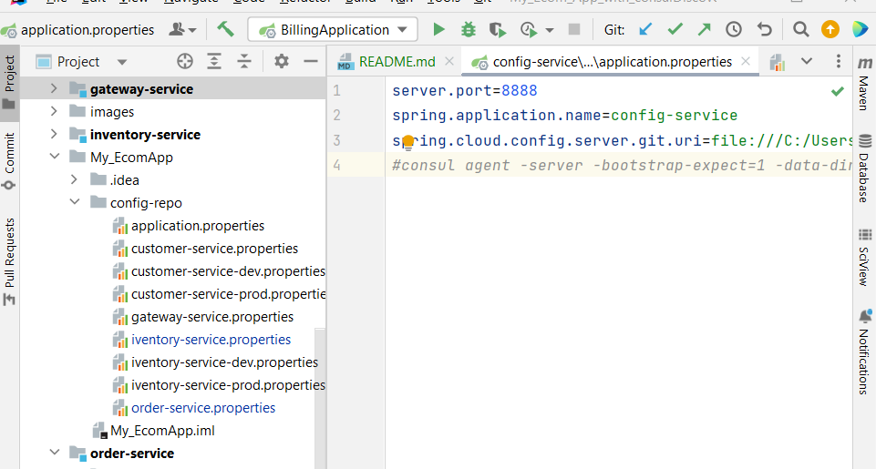

<h1>microservices-based application:</h1>
<h3>I. Introduction</h3>

The project aims to develop a comprehensive microservices-based application to manage various aspects of the e-commerce platform, with a specific focus on billing, product management, and customer interactions. The key components of the system include Consul Discovery, Spring Cloud Config, Spring Cloud Gateway, Customer-service, Inventory Service, Order Service, Consul Config for the Billing Service, Vault for the Billing Service, and a user Frontend Web developed with Angular.

<h3>II. Project Steps</h3>

<h4>1.Consul Discovery:</h4>  

Objective: Enable dynamic service discovery and registration.

 
<h4><b>2.Spring Cloud Config:</b></h4>

Objective: Centralized configuration management for microservices.

<h6>Actuator Refresh Configurations</h6>

<h6>Customer Configuration</h6>

<h4><b>2.Consul Config:</b></h4>

<h4>3.Spring Cloud Gateway:</h4>
 

Objective: Act as a gateway for routing and managing communication between microservices.

<h4>4.Customer-service:</h4>

Objective: Manage customer-related information.

 
<h4>5.Inventory Service:</h4>

Objective: Manage product inventory and availability.

 
<h4>6.Order Service:</h4>

Objective: Manage customer orders and interactions with other services.

 

 
<h4>7.Vault (Billing Service):</h4>

Objective: Secure management of sensitive billing-related information, often referred to as secrets.

 
<h4>7.Consul and Vault Configurations</h4>

<h4>Frontend Web with Angular:</h4>
<h5>Product List</h5>

<h5>Customers</h5>

<h5>Customer Orders : Customer 1</h5>

<h5>Order Details of Customer 1</h5>

